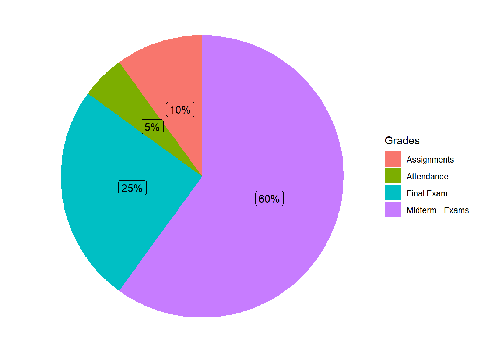
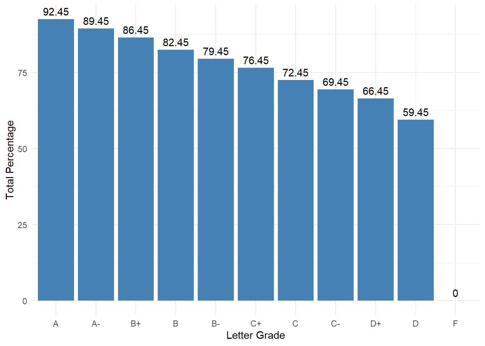

## Course Webpage

[MATH 201](home.html)

## Course Description

This course both satisfies the Quantitative Reasoning Requirement in the General Education Curriculum and serves as a foundational course for other mathematics courses.

A.  Connection to General Education:

-   Skills

    -   Ethical Engagement: Critical Thinking, Creative Thinking, Problem-Solving
    -   Engagement with Information: Data Analysis

-   UN Sustainable Development Goals (SDGs) focused upon:

    -   #3 Good Health and Well-Being
    -   #4 Quality Education
    -   #8 Decent Work and Economic Growth

B. Mathematical Focus

MATH 110 is an applied mathematics course that presents a mathematical way of thinking and provides students with experiential opportunities to explore how to quantitatively analyze complex problems. Four general areas are covered: a review of mathematical functions and their applications; the mathematics of finance; creation, use, and interpretation of models involving real-world data; and linear programming and optimization. Applications are relevant for sustainability issues, business and management, economics and finance, and the social and natural sciences.

## Textbook

-   No text books required

## Course Objectives

After successfully completing this course, each student will

-   define basic mathematics functions including polynomial, logarithmic and exponential functions
-   model real-world dataset using appropriate mathematics functions
-   explain the applications of exponential functions in finance use these functions in solving problems in finance
-   implement linear programming technique in solving optimization problems
-   compute the derivatives of basic mathematics functions and apply the derivatives to solve optimization problems

## Grades

::: {.cell}
::: {.cell-output-display}
{width=672}
:::
:::

-   *Assignments and Case-studies*: Tentatively, the assignments and case studies will be done during class where you can ask questions.

-   *Attendance*: The class have totally 15 meetings. Each time you attend a meeting, your total grade will be increased by 1.5%.

## Grades Scale

The numerical grades are converted to letter grades as follows.

|     |                |     |                |
|-----|----------------|-----|----------------|
| A   | 92.45 - 100%   | C   | 72.45 - 76.44% |
| A-  | 89.45 - 92.44% | C-  | 69.45 - 72.44% |
| B+  | 86.45 - 89.44% | D+  | 66.45 - 69.44% |
| B   | 82.45 - 86.44% | D   | 59.45 - 66.44% |
| B-  | 79.45 - 82.44% | F   | Below 59.44%   |
| C+  | 76.45 - 79.44% |     |                |

::: {.cell}
::: {.cell-output-display}
{width=672}
:::
:::

## Tentative Topics

-   Review of mathematical functions and their applications; 
-   The mathematics of finance; creation, use, and interpretation of models involving real-world data; 
-   Linear Programming and Optimization
-   Derivatives and Optimization

## Sustainable Development Goals

We will occasionally discuss and work with data related to the [United Nation Sustainable Development Goals](https://sdgs.un.org/goals). These goals are called by the UN for action in a global partnership to provide peace and prosperity for people and the planet, now and into the future. Specifically, we will focus one of the following three SDGs:

-   [SDG 3](https://www.globalgoals.org/goals/3-good-health-and-well-being/): Good Health & wellbeing\
-   [SDG 4](https://www.globalgoals.org/goals/4-quality-education/): Quality Education\
-   [SDG 8](https://www.globalgoals.org/goals/8-decent-work-and-economic-growth/): Decent Work and Economic Growth

## Academic Misconduct

Cheating will result in an F as your final grade and may result in your expulsion from the University. All cheating will be reported to the Chair of the Mathematics Department and Academic Advising.

## Regarding Diversity

In this course, and all your courses at Bryant, and throughout the Bryant learning community, we value and respect diversity. This includes differences in race, ethnicity, nationality, gender, gender identity, sexuality, socioeconomic status, ability, and religion.

